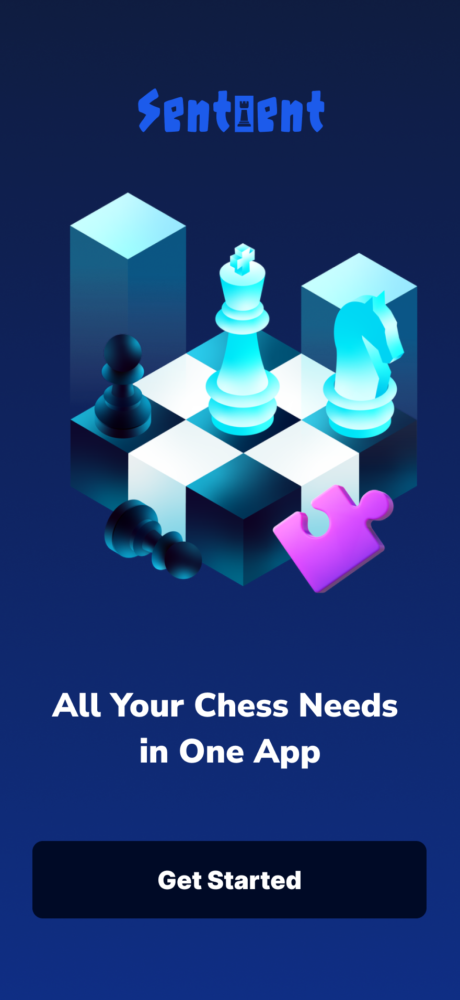
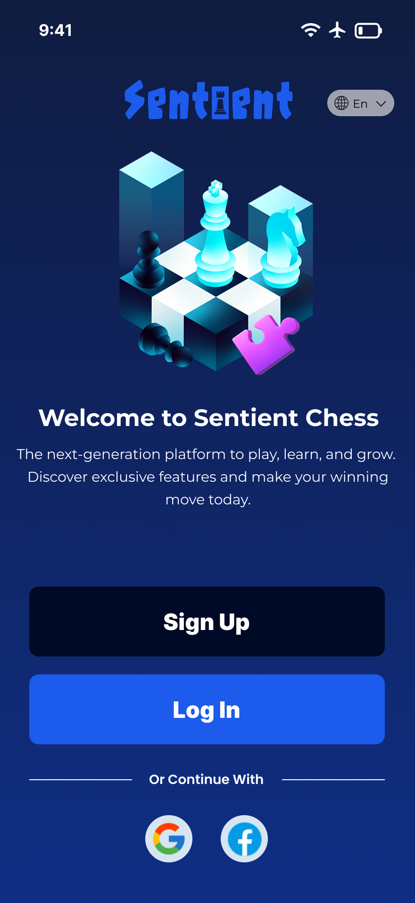

<p align="center">
  
</p>
<h1 align="center">♟️ Sentient Chess</h1>
<p align="center">
  <b>Aplikasi Catur Modern & Komunitas Chess Masa Kini</b><br>
  
  
  
  
  
  
  
</p>

---

## ✨ Fitur Utama

- ♟️ **Main Chess Board**: Bermain catur dengan AI atau teman (**coming soon**)
- 🏆 **Kompetisi & Leaderboard**: Ikuti turnamen dan lihat ranking pemain (**coming soon**)
- 📊 **Statistik Permainan**: Lihat riwayat, grafik performa, dan analisis langkah (**coming soon**)
- 🧑‍🎓 **Belajar & Puzzle**: Latihan taktik, puzzle harian, dan video pembelajaran (**coming soon**)
- 🌐 **Komunitas & Forum**: Diskusi, share strategi, dan update komunitas (**coming soon**)
- 🔒 **Login & Register Modern**: Daftar/login dengan email, Google, Facebook
- 🎨 **UI Modern & Animasi**: Tampilan elegan, transisi animasi smooth, dan gradient dinamis
- 🌍 **Multi-bahasa**: Dukungan berbagai bahasa (**coming soon**)
- 📱 **Responsif**: Nyaman di semua ukuran layar

---

## 📅 Event 
- Ikuti event catur online & offline, turnamen komunitas, dan challenge seru lainnya.

## 🎓 Course 
- Belajar catur dari master, video course, dan materi interaktif.

## 📰 Article 
- Baca artikel strategi, berita catur, dan tips eksklusif dari para ahli.

## 🛒 Shop 
- Beli perlengkapan catur, merchandise, dan item digital langsung dari aplikasi.

---

## 🚀 Instalasi & Menjalankan

1. **Clone repository:**
   ```bash
   git clone https://github.com/ardlikafi/sentient-chess.git
   cd sentient-chess
   ```
2. **Install dependencies:**
   ```bash
   flutter pub get
   ```
3. **Jalankan aplikasi:**
   ```bash
   flutter run
   ```

---

## 🛠️ Stack & Teknologi

- **Flutter 3.x** — UI modern multiplatform
- **Dart** — Bahasa pemrograman utama
- **Image Picker** — Upload foto profil
- **(Coming soon)**: Firebase, REST API, Notifikasi, dan lainnya

---

## 📸 Preview

<p align="center">
  
  
  
  <!-- Tambahkan screenshot lain jika ada -->
</p>

---

## 🤝 Kontribusi

Kontribusi terbuka untuk fitur, bug, atau ide baru!  
1. Fork repo ini  
2. Buat branch baru  
3. Pull request ke main

---

## 📬 Kontak & Dukungan

Untuk pertanyaan, saran, atau kerjasama, hubungi:  
📧 admin@sentient.com

---

<p align="center">
  Dibuat dengan ❤️ oleh Tim Sentient Chess
</p>
